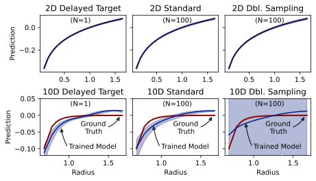
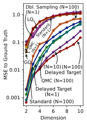

# Learning from Integral Losses
This repository contains the experiments conducted in our paper ["Learning from Integral Losses in Physics Informed Neural Networks"](https://proceedings.mlr.press/v235/saleh24a.html). 

In short, this paper pinpoints the biased nature of the MSE loss when training PINNs under integro-differntial equations, proposes multiple solutions, and extensively benchmarks them on Poisson, Maxwell, and Smoluchowski PDE systems.

Here is a comparison of our methods on an example Poisson problem

 

## Interactive Data Visualization Dashboards

You can check the following interactive dashboards for the ablation studies in the paper. 

These may take a few moments to load, and may require adjusting the zoom level for a proper layout.

* [The 2-Dimensional Poisson Problem Ablations Dashboard (44 MB)](https://ehsansaleh.web.illinois.edu/data/btspinn/59_poisson.html)
* [The High-Dimensional Poisson Solutions Visualization Dashboard (28 MB)](https://ehsansaleh.web.illinois.edu/data/btspinn/18_hdpviz.html)
* [The High-Dimensional Poisson Training Curves Dashboard (74 MB)](https://ehsansaleh.web.illinois.edu/data/btspinn/35_poisshidim.html)
* [The High-Dimensional Poisson Delayed Target Sample Size Ablations Dashboard (45 MB)](https://ehsansaleh.web.illinois.edu/data/btspinn/47_poisshidim.html)
* [The Maxwell-Ampere Problem Ablations Dashboard (31 MB)](https://ehsansaleh.web.illinois.edu/data/btspinn/55_maxwell.html)
* [The Maxwell-Ampere Delayed Target Ablations Dashboard (16 MB)](https://ehsansaleh.web.illinois.edu/data/btspinn/33_btsmaxwell.html)
* [The Smoluchowski Problem Ablations Dashboard (3 MB)](https://ehsansaleh.web.illinois.edu/data/btspinn/02_smoluchowski.html)

## Code Documentation

<details open>
<summary><h2>Quick Q&A Rounds</h2></summary>

1. **Question**: Give me a quick-starter code to start reproducing the paper trainings on a GPU?
   ```bash
   git clone https://github.com/ehsansaleh/btspinn.git
   cd ./btspinn
   make venv
   ./main.sh
   ```

2. **Question**: Give me a simple python command to run?
   ```bash
   python bspinn/poisson.py -c "01_poisson/30_btstrp2d" -d "cuda:0" -s 1 -r 0 -i 0
   python bspinn/smolluchowski.py -c "02_smoll/01_btstrp" -d "cuda:0" -s 1 -r 0 -i 0
   python bspinn/maxwell.py -c "03_maxwell/01_rect" -d "cuda:0" -s 1 -r 0 -i 0
   ```

    <details>
    <summary><strong>More Information</strong></summary> 
    
    This will
      * run the configuration specifed at [`./configs/01_poisson/30_btstrp2d.yml`](./configs/01_poisson/30_btstrp2d.yml), and
      * store the generated outputs periodically at `./results/01_poisson/30_btstrp2d_00.h5`.
      * This specific yaml config file defines a large collection of configs to train independently.
        * You can see the looping tree defined at the end of the config file.
        * Let's say this file is defining 32 different configs to train.
      * The `-s 1` option means that there is only a single worker/device available.
        *  You can split the work among 4 workers/GPUs by specifying `-s 4`.
        *  This way, the entire 32 configs will be split among the 4 workers.
        *  In other words, each worker/device would work on 8 configs by specifying `-s 4`.
      * The `-r 0` option specifies the rank of the worker.
        * Since there is a single worker with `-s 0`, only a rank of `0` is meaningful here.
        * If you have 4 workers and specify `-s 4`, you will have to run 4 parallel copies of the program.
          * That is, four parallel copies with `-i 0`, `-i 1`, `-i 2`, and `-i 3`.
      * The `-i 0` option means that the resuming config index should start at 0.
        * Specifying `-i 8` means that the first 8 configs assigned to this worker are already trained.
          * Therefore, we should start by training the 9th config.
          * This can be helpful if you had stopped the training after a few configs, and want to resume your work.
     </details>

   <details>
   <summary>3. <strong>Question:</strong> How can I reproduce the paper figures?</summary>
     
   Most of the figures are generated using the [`./notebook/29_plotting.ipynb`](./notebook/29_plotting.ipynb) notebook.

   1. First, you need to perform the necessary trainings using either the `./main.sh` or `python bspinn/*.py` scripts.
      1. This step will create some training "results".   
   3. Then, you have to "summarize" these training results
      1. This is mainly done by calling `make summary` or `python bspinn/summary.py ...`.
      2. Each yaml config file is part of an "experiment".
         1. Experiments are essentially a collection of training configs.
         2. You can see the experiments' definition in `bspinn/z01_expspec.yml`
      4. This command will collect the training result files from the `./results` directory, and process them into summarized files at the [`./summary`](./summary) directory.
   4. Now that you have the summary files, you can use the plotting notebook.
   </details>

   <details>
   <summary>4. <strong>Question:</strong> You seem to have too many directories, files, and a fancy structure. Explain the whole thing as simple as possible?</summary>
     
   ```
                        ./main.sh or
                  python bspinn/poisson.py or
                python bspinn/smolluchowsky.py or
                  python bspinn/maxwell.py or                 make summary                
   configs/*.yml =============================> results/*.h5 =============> summary/*.h5


                 notebook/29_plotting.ipynb
   summary/*.h5 ============================> notebook/29_plotting/*.pdf
   ```

   </details>
  
   <details>
   <summary>5. <strong>Question:</strong> What are the python environment package requirements?</summary>
   
   * The code should run well with `python 3.11`.
     
   * The training code mainly needs `numpy` and `torch`.
     
   * For generating the figures and dashboards, you also need `matplotlib`, `bokeh`, etc.
     
   * If you don't like messing up with your own environment, just run `make venv` in the terminal.
    
      * This will create a virtual environment at `./venv` and install our specified dependencies.
    
      * Our shell scripts (e.g., [`main.sh`](./main.sh)) will automatically activate and use this environment once it exists.
     
   * Feel free to edit the [`activate`](./activate) under the environement activation section and add your custom activation lines.
    
      * We source the [`activate`](./activate) code in all of our shell scripts, so your changes will automatically have a global effect.
     
   </details>

</details>

<details open>
<summary><h2>Technical Rundown</h2></summary>

1. **Python Environment**: You can setup either a vritual or a micromamba environment.

   1. **Venv**: Run `make venv` to setup a virtual environment and use `source ./activate` to activate it.

   2. **Micromamba**: Run `make mamba` to install micromamba and an environment and use `source ./activate mamba` to activate it.

2. **Hyper-parameters**: The training configuration files, in YAML format, can be found at the [`configs`](./configs) directory.

3. **Running**: See [`./main.sh`](./main.sh) for an example bash script running an array of trainings.

4. **Training Code**: The python scripts and the jupyter notebook codes are identical.

   | Problem           | Python Script                                        | Jupyter Notebook                                                       |
   | :---------------: | :--------------------------------------------------: | :--------------------------------------------------------------------: |
   | Poisson           | [`bspinn/poisson.py`](./bspinn/poisson.py)           | [`notebook/26_poisson.ipynb`](./notebook/26_poisson.ipynb)             |
   | Maxwell-Ampere    | [`bspinn/maxwell.py`](./bspinn/maxwell.py)           | [`notebook/18_maxwell.ipynb`](./notebook/18_maxwell.ipynb)             |
   | Smoluchowski      | [`bspinn/smoluchowski.py`](./bspinn/smoluchowski.py) | [`notebook/10_smolluchowski.ipynb`](./notebook/10_smolluchowski.ipynb) |

5. **Summarization**: This step compiles the training statistics of many trainings into a single HDF summary file.

   1. **Experiment Specifications**: See the [`z01_expspec.yml`](./bspinn/z01_expspec.yml) config.

   2. **Summarization**: Either run `make summary` or `python bspinn/summary.py --lazy`.

5. **Visualization**: Most of the figures and dashboards are generated by the [`29_plotting.ipynb`](./notebook/29_plotting.ipynb) notebook.

</details>

<details open>
<summary><h2>Step-by-Step Guide to the Code</h2></summary>
   
+  <details>
   <summary><strong>Cloning the Repo</strong></summary>

   ```
   git clone https://github.com/ehsansaleh/btspinn.git
   cd ./btspinn
   ```

   </details>
   
+  <details>
   <summary><strong>[Optional] Make a Virtual Environment</strong></summary>
   
   1. Activate your favorite python version (we used 3.11).
   2. Run `make venv`.
   3. This will take a few minutes, and about 1 GB in storage.
   4. The virtual environment with all dependencies will be installed at `./venv`.
   5. You can run `source ./venv/bin/activate` to activate the venv directly.
   6. Our shell scripts check for the existence of `venv`, and will use/activate it.
   7. We have also provided similar [Makefile](./Makefile) recipes for creating Micromamba environments. 
   7. You can run `source ./activate venv` or `source ./activate mamba` for a general activation script
    * [`activate`](./activate) script checks for the existence of this virtual environment.
    * If it detects the existence of a venvn, it will automatically activate and use it in our shell scripts.
    * This actiation script is invoked at the beginning of the automated shell script [`main.sh`](./main.sh).
   </details>

+  <details>
   <summary><strong>Training Physics-Informed Neural Networks</strong></summary>
   
   +  <details>
      <summary><strong>[Manual Approach]</strong></summary>
   
      * To fire up some training yourself, run

        `python bspinn/poisson.py -c 01_poisson/30_btstrp2d -d cuda:0 -s 1 -r 0 -i 0`
      * This command will read the `01_poisson/30_btstrp2d.yml` config as input.
      * The computed accuracy statistics would be saved at  `./results/01_poisson/30_btstrp2d*.h5`.
      * Typically, this config may take a few hours to finish on an A40 or A100 GPU.
      
      </details>
   
   +  <details open>
      <summary><strong>[Shell Script's Automated Array]</strong></summary>

      * Check-out and run [`./main.sh`](./main.sh).
      * The shell script performs some inital sanity checks and activations.
      * Then it will go through the `CFGPREFIXLIST` config array sequentially.
      * Feel free to add or take off configs from the array.
      * Each problem has its own script:
        1. The Poisson problem uses the [`bspinn/poisson.py`](./bspinn/poisson.py) script for training.
        2. The Smoluchowski problem uses the [`bspinn/smoluchowski.py`](./bspinn/smoluchowski.py) script for training.
        3. The Maxwell-Ampere problem uses the [`bspinn/maxwell.py`](./bspinn/maxwell.py) script for training.
      </details>
   
   </details>

+  <details>
   <summary><strong>Summarizing the Results</strong></summary>

   Run `make summary` 
   +  <details>
      <summary><strong>The Summary Output</strong></summary>

      1. This step generates combines all the training results belonging to an experiment and publish them in a single HDF file.
      2. The summary file can then be used for plotting purposes.
      
      </details>
   
   +  <details>
      <summary><strong>More Information</strong></summary

      1. An experiment is a collection of different training runs, with various sets of hyper-parameters.
      2. Each training config file in the [`configs`](./configs) directory defines a number of trainings
         1. For instance, we define many One Variable At a Time (OVAT) hyper-parameter sweeps, or grid searches for ablation studies.
      3. Each experiment is essentially a selection of the different trainings in this code base.
      4. The experiment specifications are defined in the [`bspinn/z01_expspec.yml`](./bspinn/z01_expspec.yml) file.
      </details>

   </details>

+  <details>
   <summary><strong>Generating Our Figures</strong></summary>
   
   * Most of the paper plots are generated by the [`notebook/29_plotting.ipynb`](notebook/29_plotting.ipynb) notebook. 
   * The high-dimensional Poisson solutions are produced in the [`notebook/28_hdpviz.ipynb`](notebook/28_hdpviz.ipynb) notebook.
   * The [`notebook/22_quadquas.ipynb`](notebook/22_quadquas.ipynb) notebook can produce example Quasi Monte-Carlo and numerical Quadrature samplings.
   
   </details>
   
   </details>

</details>

<details open>
<summary><h2>Configurations and Arguments</h2></summary>

  We have included all the configurations we used to produce the results in our paper in the [`./configs`](./configs) directory.

  The hyper-parameters are sectioned, and each hyper-parameter and section comes with documentation. All configs include documentation within them. 
  
  The following are from the [`./configs/01_poisson/30_btstrp2d.yml`](configs/01_poisson/30_btstrp2d.yml) config as an example.

  +  <details>
     <summary><strong>General Options</strong></summary>

      ```yaml
      # An optional description of this config.
      desc: Ablation studies over an example 2-d delta poisson problem with delayed targeting
      # Date of the experimentation. This is optional and will not be used in training or summarization.
      date: January 13, 2022
      
      # The random number generator's list of seeds:
      #   1. The range of values must be specified in a pythonic manner: [start, stop, step]
      #   2. The number of models trained in parallel is determined by this option; this option
      #      determines the number of completely independent models trained in parallel.
      #   3. You can specify the list of seeds manually using the alternative `rng_seed/list` key.
      rng_seed/range: [0, 100000, 1000]
      # The type of problem. This is mainly used to make sure the correct script is running this config.
      problem: poisson
      # The dimensionality of the problem
      dim: 2
      ```
     </details>
  
  +  <details>
     <summary><strong>The Optimization Hyper-parameters</strong></summary>

      ```yaml
      ###################################################################################################
      ################################ The Optimization Hyper-parameters ################################
      ###################################################################################################
      # The optimizer's type. Available options are 'adam' and 'sgd'.
      opt/dstr: adam
      # The optimizer's learning rate.
      opt/lr/list: [0.001, 0.002, 0.005, 0.0005, 0.0002, 0.0001]
      # The number of optimization iterations. 
      # This is the same as the number of `.step()` calls to the optimizer. 
      opt/epoch: 200000
      ```
      </details>
  
  +  <details>
     <summary><strong> Key Surface Point and Volume Sampling Options </strong></summary>

      ```yaml
      ###################################################################################################
      ########################## Key Surface Point and Volume Sampling Options ##########################
      ###################################################################################################
      # The number of training volumes (balls) in each training iteration. In other words, this 
      # corresponds to the mini-batch size for the SGD optimizer. 
      vol/n/list: [400, 256, 128, 64, 32, 16, 8, 4, 2, 1]
      # The number of surface points evaluated by the main model.
      srfpts/n/mdl: 1
      # The number of surface points evaluated by the target model.
      srfpts/n/trg: 1
      # Whether to deterministically space the sampled surface points or not.
      srfpts/detspc: false
      # Whether to use the double-sampling trick for constructing the training loss.
      srfpts/dblsmpl: false
      ```
      </details>
  
  +  <details>
     <summary><strong> The Delayed Targeting Hyper-Parameters </strong></summary>

      ```yaml
      ###################################################################################################
      ############################# The Delayed Targeting Hyper-Parameters ##############################
      ###################################################################################################
      # Whether to use the delayed target method or not.
      trg/btstrp: true
      # The target smoothing factor in the delayed target method. 
      # This corresponds to the $\tau$ hyper-parameter in Algorithm 1 of the main paper.
      trg/tau/list: [0.999, 0.99, 0.9, 0.9999, 0.99999]
      # The target regularization weight in the delayed target method. 
      # This corresponds to the $\lambda$ hyper-parameter in Algorithm 1 of the main paper.
      trg/reg/w/list: [1.0, 0.1, 10.0]
      # The target weight in the delayed target method. 
      # This determines the `M` hyper-parameter in Equation 5 of the main paper; The target weight is 
      # essentially the same as $(M-1)/M$.
      trg/w/list: [0.99, 0.9, 0.999, 0.9999]
      ```
      </details>
  
  +  <details>
     <summary><strong> The Function Approximation Hyper-parameters </strong></summary>

      ```yaml
      ###################################################################################################
      ########################### The Function Approximation Hyper-parameters ###########################
      ###################################################################################################
      # The type of neural network. The only available option is `mlp`.
      nn/dstr: mlp
      # The width of the neural network; this is the number of neural units in each layer.
      nn/width/list: [64, 32, 128]
      # The number of hidden layers in the neural network.
      nn/hidden/list: [2, 1, 3, 4]
      # The activation function of the network. The available values are `['silu', 'tanh', 'relu']`.
      nn/act/list: [silu, tanh, relu]
      ```
      </details>
  
  +  <details>
     <summary><strong> The Poisson Charge Specifications </strong></summary>

      ```yaml
      ###################################################################################################
      ################################ The Poisson Charge Specifications ################################
      ###################################################################################################
      # This section defines the Poisson charges. Note that these are problem-defining hyper-parameters, 
      # as opposed to optimization or solver-related hyper-parameters.
      
      # The poisson charges type. The only available option is `dmm` (i.e., "Delta Mixture Model").
      chrg/dstr: dmm
      # The number of delta charges in the mixture.
      chrg/n: 3
      # The weight of each delta charge.
      chrg/w: [1.0]

      ###########################################################
      ### Ablating the Delta Charge Location Hyper-Parameters ###
      ###########################################################
      # The following groups are independent ways of placing out the Poisson charge locations inside
      # the 2D space. Each group will be tested out one at a time and compared in the supplementary 
      # ablation studies.
      
      #############################
      ###### Static Charges #######
      #############################
      # Group 1: Placing the 3 charges at the [-0.5, 0.5], [0.0, 0.0], and [0.5, 0.5] points.
      
      # The poisson delta charge locations.
      g01/chrg/mu: [[-0.5], [0.0], [0.5]]
      
      #############################
      # IID Unifrom Cube Charges ##
      #############################
      # Group 2: Placing the charges stochastically and uniformly. The charges will be placed in an IID 
      # manner, and uniformly in a square spanning from the lower left corner of [-1, -1] to the upper 
      # right corner of [1, 1].
      
      # The poisson delta charge location distribution:
      #   1. `uniform` means the charge locations are sampled uniformly from a cube in an iid manner.
      #   2. `normal` means the charge locations are sampled normally in an iid manner.
      #   3. `ball` means the charge locations are sampled uniformly from a ball in an iid manner.
      g02/chrg/mu/dstr: uniform
      # The lower left corner of the cube used for uniformly sampling the delta poisson charge locations.
      g02/chrg/mu/low:  [[-1.0]]
      # The top right corner of the cube used for uniformly sampling the delta poisson charge locations.
      g02/chrg/mu/high: [[ 1.0]]
      
      #############################
      #### IID Normal Charges #####
      #############################
      # Group 3: Placing the charges stochastically and normally. The charges will be placed in an IID 
      # manner, following a normal distribution.
      
      # The poisson delta charge location distribution:
      #   1. `uniform` means the charge locations are sampled uniformly from a cube in an iid manner.
      #   2. `normal` means the charge locations are sampled normally in an iid manner.
      #   3. `ball` means the charge locations are sampled uniformly from a ball in an iid manner.
      g03/chrg/mu/dstr: normal
      # The mean of the normal distribution used for sampling the delta poisson charge locations.
      g03/chrg/mu/loc:  [[0.0]]
      # The scale of the normal distribution used for sampling the delta poisson charge locations.
      g03/chrg/mu/scale: [1.0]
      
      #############################
      # IID Unifrom Ball Charges ##
      #############################
      # Group 4: Placing the charges stochastically and uniformly. The charges will be placed in an IID 
      # manner, and uniformly in a unit ball centered at [0.0, 0.0] with a radius of 1.
      
      # The poisson delta charge location distribution:
      #   1. `uniform` means the charge locations are sampled uniformly from a cube in an iid manner.
      #   2. `normal` means the charge locations are sampled normally in an iid manner.
      #   3. `ball` means the charge locations are sampled uniformly from a ball in an iid manner.
      g04/chrg/mu/dstr: ball
      # The hyper-center of the uniform ball used for uniformly sampling the delta poisson 
      # charge locations.
      g04/chrg/mu/c:  [[0.0]]
      # The hyper-radius of the uniform ball used for uniformly sampling the delta poisson 
      # charge locations.
      g04/chrg/mu/r:   [1.0]
      ```
      </details>
  
  +  <details>
     <summary><strong> The Training Integration Volume Hyper-Parameters </strong></summary>

      ```yaml
      ###################################################################################################
      ######################## The Training Integration Volume Hyper-Parameters #########################
      ###################################################################################################
      # The type of the training volumes. The only available option is 'ball'.
      vol/dstr: ball
      
      ###########################################################
      # Ablating the Ball Center Distribution Hyper-Parameters ##
      ###########################################################
      # The next groups define a few ways of specifying the sampling distribution of the ball centers. 
      # Each group will be tested out one at a time and compared in the supplementary ablation studies.
      
      #############################
      ### Uniform Cube Centers ####
      #############################
      # Group 5: Placing the ball centers stochastically and uniformly. The ball centers will be placed 
      # in an IID manner, and uniformly in a square spanning from the lower left corner of [-1, -1] to 
      # the upper right corner of [1, 1].
      
      # The training volume center distribution:
      #   1. `ball` means that the training volume centers will be sampled in an IID and uniform manner 
      #       within a ball.
      #   2. `uniform` means the ball centers are sampled uniformly within a cube.
      #   3. `normal` means the ball centers are sampled from a normal distribution.
      g05/vol/c/dstr: uniform
      # The lower-left corner of the cube used for uniformly sampling the training volume centers.
      g05/vol/c/low:  [-1.0]
      # The top-right corner of the cube used for uniformly sampling the training volume centers.
      g05/vol/c/high: [ 1.0]
      
      #############################
      ### Uniform Ball Centers ####
      #############################
      # Group 6: Placing the ball centers stochastically and uniformly. The ball centers will be placed 
      # in an IID manner, and uniformly in a unit ball centered at [0.0, 0.0] with a radius of 1.
      
      # The training volume center distribution:
      #   1. `ball` means that the training volume centers will be sampled in an IID and uniform manner 
      #       within a ball.
      #   2. `uniform` means the ball centers are sampled uniformly within a cube.
      #   3. `normal` means the ball centers are sampled from a normal distribution.
      g06/vol/c/dstr: ball
      # The hyper-center of the uniform ball used for uniformly sampling the training volume centers.
      g06/vol/c/c:  [0.0]
      # The hyper-radius of the uniform ball used for uniformly sampling the training volume centers.
      g06/vol/c/r:   1.0
      
      #############################
      ###### Normal Centers #######
      #############################
      # Group 7: Placing the ball centers stochastically and normally. The ball centers will be placed 
      # in an IID manner, following a normal distribution.
      
      # The training volume center distribution:
      #   1. `ball` means that the training volume centers will be sampled in an IID and uniform manner 
      #       within a ball.
      #   2. `uniform` means the ball centers are sampled uniformly within a cube.
      #   3. `normal` means the ball centers are sampled from a normal distribution.
      g07/vol/c/dstr: normal
      # The mean of the normal distribution used for sampling the training volume centers.
      g07/vol/c/loc:  [0.0]
      # The scale of the normal distribution used for sampling the training volume centers.
      g07/vol/c/scale: 1.0
      
      ###########################################################
      # Ablating the Ball Radius Distribution Hyper-Parameters ##
      ###########################################################
      # The next groups define a few ways of specifying the sampling distribution of the ball radii. 
      # Each group will be tested out one at a time and compared in the supplementary ablation studies.
      
      #############################
      ###### Uniform Radii 1 ######
      #############################
      # Group 8: Choosing the ball radii stochastically and uniformly. The ball radii will be sampled in 
      # an IID manner over the `[0.1, 1.5]` interval.
      
      # The training volume radius distribution:
      #   1. `uniform` makes the radii themselves sampled uniformly from a 1-d interval.
      #   2. `unifdpow` samples the radii such that their `d`-th power is distributed uniformly, where 
      #      `d` is the problem space dimension.
      g08/vol/r/dstr: uniform
      # The lower end of the sampled radii for the training volumes.
      g08/vol/r/low:  0.1
      # The higher end of the sampled radii for the training volumes.
      g08/vol/r/high: 1.5
      
      #############################
      ###### Uniform Radii 2 ######
      #############################
      # Group 9: Choosing the ball radii stochastically and uniformly. The ball radii will be sampled in 
      # an IID manner over the `[0.0, 1.0]` interval.
      
      # The training volume radius distribution:
      #   1. `uniform` makes the radii themselves sampled uniformly from a 1-d interval.
      #   2. `unifdpow` samples the radii such that their `d`-th power is distributed uniformly, where 
      #      `d` is the problem space dimension.
      g09/vol/r/dstr: uniform
      # The lower end of the sampled radii for the training volumes.
      g09/vol/r/low:  0.0
      # The higher end of the sampled radii for the training volumes.
      g09/vol/r/high: 1.0
      
      #############################
      ## Uniform Radii-Squared 1 ##
      #############################
      # Group 10: Choosing the square of the ball radii stochastically and uniformly. The squared ball 
      # radii will be sampled in an IID manner over the `[0.0, 1.0]` interval.
      
      # The training volume radius distribution:
      #   1. `uniform` makes the radii themselves sampled uniformly from a 1-d interval.
      #   2. `unifdpow` samples the radii such that their `d`-th power is distributed uniformly, where 
      #      `d` is the problem space dimension.
      g10/vol/r/dstr: unifdpow
      # The lower end of the sampled radii for the training volumes.
      g10/vol/r/low:  0.0
      # The higher end of the sampled radii for the training volumes.
      g10/vol/r/high: 1.0
      
      #############################
      ## Uniform Radii-Squared 2 ##
      #############################
      # Group 11: Choosing the square of the ball radii stochastically and uniformly. The squared ball 
      # radii will be sampled in an IID manner over the `[0.0, sqrt(2)]` interval.
      
      # The training volume radius distribution:
      #   1. `uniform` makes the radii themselves sampled uniformly from a 1-d interval.
      #   2. `unifdpow` samples the radii such that their `d`-th power is distributed uniformly, where 
      #      `d` is the problem space dimension.
      g11/vol/r/dstr: unifdpow
      # The lower end of the sampled radii for the training volumes.
      g11/vol/r/low:  0.0
      # The higher end of the sampled radii for the training volumes.
      g11/vol/r/high: sqrt(dim)
      
      #############################
      ## Uniform Radii-Squared 3 ##
      #############################
      # Group 12: Choosing the square of the ball radii stochastically and uniformly. The squared ball 
      # radii will be sampled in an IID manner over the `[0.0, sqrt(3)]` interval.
      
      # The training volume radius distribution:
      #   1. `uniform` makes the radii themselves sampled uniformly from a 1-d interval.
      #   2. `unifdpow` samples the radii such that their `d`-th power is distributed uniformly, where 
      #      `d` is the problem space dimension.
      g12/vol/r/dstr: unifdpow
      # The lower end of the sampled radii for the training volumes.
      g12/vol/r/low:  0.0
      # The higher end of the sampled radii for the training volumes.
      g12/vol/r/high: sqrt(dim+1)
      ```
      </details>
  
  +  <details>
     <summary><strong> The Initial Condition Specifications </strong></summary>

      ```yaml
      ###################################################################################################
      ############################## The Initial Condition Specifications ###############################
      ###################################################################################################
      # The next groups define two ways of specifying the Initial Condition (IC) sampling distributions.
      
      # The Initial Condition loss weight.
      ic/w: 1.0
      # The set of Back-Propagation Parameters (BPP) for the IC loss. 
      #   1. A value of `bias` means that the IC loss is only parameterized by output layer's bias, 
      #      and is treated as a constant with respect to the other neural parameters. 
      #   2. A value of `all` means IC loss is parameterized by all the neural network parameters.
      ic/bpp/list: [bias, all]
      
      ###########################################################
      # Ablating the Initial Condition Point Sets Distribution ##
      ###########################################################
      # The next groups define a few ways of specifying the sampling distribution of the IC points. 
      # Each group will be tested out one at a time.
      
      #############################
      ##### Spherical Samples #####
      #############################
      # Group 13: Sample the IC points stochastically from a fixed sphere
      
      # The IC points distribution. Available options are 'sphere' for sampling the IC points from a 
      # fixed sphere, and 'trnsrf' for sampling the IC points from the training volume surfaces. 
      g13/ic/dstr: sphere
      # The size of the IC points set.
      g13/ic/n: 1024
      # The re-sampling frequency of the IC points. 
      #   1. A frequency value of 0 means that the points are sampled once at the very beginning and 
      #      used identically throughout the training. 
      #   2. A frequency value of 1 means that the IC points are re-sampled every epoch. 
      #   3. A frequency value of 5 means that the IC points are re-sampled every 5 epochs. 
      g13/ic/frq: 0
      # The mini-batch size used for defining the IC loss in each epoch.
      g13/ic/bs: 32
      # The center of the sphere for sampling the IC points.
      g13/ic/c: [0.0]
      # The radius of the sphere for sampling the IC points.
      g13/ic/r: 1.0
      
      #############################
      # Training Surface Samples ##
      #############################
      # Group 14: Sampling the IC points on the edge of the training surface.
      
      # The IC points distribution. Available options are 'sphere' for sampling the IC points from a 
      # fixed sphere, and 'trnsrf' for sampling the IC points from the training volume surfaces. 
      g14/ic/dstr: trnsrf
      # The re-sampling frequency of the IC points. A value of 0 means that the points are sampled once 
      # at the very beginning and used identically throughout the training. A frequency value of 5 means 
      # that the IC points are re-samples every 5 epochs. 
      g14/ic/frq: 0
      ```
      </details>
  
  +  <details>
     <summary><strong> The Evaluation Distribution Profiles </strong></summary>

      ```yaml
      ###################################################################################################
      ############################## The Evaluation Distribution Profiles ###############################
      ###################################################################################################
      
      ###########################################################
      ###### The "IID Uniform Rectangle" Evaluation Profile #####
      ###########################################################
      
      # The evaluation points distribution:
      #   1. `uniform` dentoes sampling uniformly from a rectangle.
      #   2. `ball` dentoes sampling uniformly from a ball.
      #   3. `trnvol` dentoes sampling uniformly from within the training volumes.
      eval/iidur/dstr: uniform
      # The lower-left corner of the rectangle for sampling the evaluation points uniformly.
      eval/iidur/low:  [-1.0]
      # The top-right corner of the rectangle for sampling the evaluation points uniformly.
      eval/iidur/high: [ 1.0]
      # Whether the points radii and angles should sampled independently or in a joint manner.
      eval/iidur/rx/dstr: joint
      # Whether the sampled points must be static (i.e., sampled once at the beginning and fixed).
      eval/iidur/rx/static: false
      # The size of the evaluation points set.
      eval/iidur/n: 5000
      # The frequency of evaluation in epochs.
      eval/iidur/frq: 500
      
      ###########################################################
      ####### The "IID Uniform Ball 1" Evaluation Profile #######
      ###########################################################
      
      # The evaluation points distribution:
      #   1. `uniform` dentoes sampling uniformly from a rectangle.
      #   2. `ball` dentoes sampling uniformly from a ball.
      #   3. `trnvol` dentoes sampling uniformly from within the training volumes.
      eval/iidub1/dstr: ball
      # The center of the ball for sampling the evaluation points uniformly.
      eval/iidub1/c: [0.0]
      # The radius of the ball for sampling the evaluation points uniformly.
      eval/iidub1/r: 1.0
      # Whether the points radii and angles should sampled independently or in a joint manner.
      eval/iidub1/rx/dstr: joint
      # Whether the sampled points must be static (i.e., sampled once at the beginning and fixed).
      eval/iidub1/rx/static: false
      # The size of the evaluation points set.
      eval/iidub1/n: 5000
      # The frequency of evaluation in epochs.
      eval/iidub1/frq: 500
      
      ###########################################################
      ## The "Deterministic Uniform Ball 1" Evaluation Profile ##
      ###########################################################
      # In the `detub1` evaluation profile, the points radii and angles are sampled independently 
      # and deterministically. This was explained in more detail in Section D.8 and Algorithm 2 of 
      # the supplementary material.
      
      # The evaluation points distribution:
      #   1. `uniform` dentoes sampling uniformly from a rectangle.
      #   2. `ball` dentoes sampling uniformly from a ball.
      #   3. `trnvol` dentoes sampling uniformly from within the training volumes.
      eval/detub1/dstr: ball
      # The center of the ball for sampling the evaluation points uniformly.
      eval/detub1/c: [0.0]
      # The radius of the ball for sampling the evaluation points uniformly.
      eval/detub1/r: 1.0
      # Whether the points radii and angles should sampled independently or in a joint manner.
      eval/detub1/rx/dstr: indep
      # Whether the point radii should be sampled in a deterministic or IID manner.
      eval/detub1/rx/r/dstr: det
      # The number of radii bins when deterministically sampling of the points radii.
      eval/detub1/rx/r/n: 5
      # Whether the point angles should sampled in a deterministic or IID manner.
      eval/detub1/rx/x/dstr: iid
      # Whether the sampled angles must be static (i.e., sampled once at the beginning and fixed).
      eval/detub1/rx/x/static: true
      # The size of the evaluation points set.
      eval/detub1/n: 5000
      # The frequency of evaluation in epochs.
      eval/detub1/frq: 500
      
      ###########################################################
      ###### The "IID Uniform Ball 2" Evaluation Profile ########
      ###########################################################
      # The `iidub2` is the same as `iidub1` profile, except the ball radius is set to `sqrt(2)` 
      # rather than one.
      
      # The evaluation points distribution:
      #   1. `uniform` dentoes sampling uniformly from a rectangle.
      #   2. `ball` dentoes sampling uniformly from a ball.
      #   3. `trnvol` dentoes sampling uniformly from within the training volumes.
      eval/iidub2/dstr: ball
      # The center of the ball for sampling the evaluation points uniformly.
      eval/iidub2/c: [0.0]
      # The radius of the ball for sampling the evaluation points uniformly.
      eval/iidub2/r: sqrt(dim)
      # Whether the points radii and angles should sampled independently or in a joint manner.
      eval/iidub2/rx/dstr: joint
      # Whether the sampled points must be static (i.e., sampled once at the beginning and fixed).
      eval/iidub2/rx/static: false
      # The size of the evaluation points set.
      eval/iidub2/n: 5000
      # The frequency of evaluation in epochs.
      eval/iidub2/frq: 500
      
      ###########################################################
      ## The "Deterministic Uniform Ball 2" Evaluation Profile ##
      ###########################################################
      # In the `detub2` evaluation profile is identical to the `detub1` profile, except the ball radius 
      # is set to `sqrt(2)` rather than one.
      
      # The evaluation points distribution:
      #   1. `uniform` dentoes sampling uniformly from a rectangle.
      #   2. `ball` dentoes sampling uniformly from a ball.
      #   3. `trnvol` dentoes sampling uniformly from within the training volumes.
      eval/detub2/dstr: ball
      # The center of the ball for sampling the evaluation points uniformly.
      eval/detub2/c: [0.0]
      # The radius of the ball for sampling the evaluation points uniformly.
      eval/detub2/r: sqrt(dim)
      # Whether the points radii and angles should sampled independently or in a joint manner.
      eval/detub2/rx/dstr: indep
      # Whether the point radii should be sampled in a deterministic or IID manner.
      eval/detub2/rx/r/dstr: det
      # The number of radii bins when deterministically sampling of the points radii.
      eval/detub2/rx/r/n: 5
      # Whether the point angles should sampled in a deterministic or IID manner.
      eval/detub2/rx/x/dstr: iid
      # Whether the sampled angles must be static (i.e., sampled once at the beginning and fixed).
      eval/detub2/rx/x/static: true
      # The size of the evaluation points set.
      eval/detub2/n: 5000
      # The frequency of evaluation in epochs.
      eval/detub2/frq: 500
      
      ###########################################################
      ##### The "IID Training Volume 1" Evaluation Profile ######
      ###########################################################
      # In the `iidtv1` profile, the evaluation points are sampled uniformly from within the training 
      # volumes.
      
      # The evaluation points distribution:
      #   1. `uniform` dentoes sampling uniformly from a rectangle.
      #   2. `ball` dentoes sampling uniformly from a ball.
      #   3. `trnvol` dentoes sampling uniformly from within the training volumes. 
      eval/iidtv1/dstr: trnvol
      # Whether the points radii and angles should sampled independently or in a joint manner.
      eval/iidtv1/rx/dstr: joint
      # Whether the sampled angles must be static (i.e., sampled once at the beginning and fixed).
      eval/iidtv1/rx/static: false
      # The size of the evaluation points set.
      eval/iidtv1/n: 250000
      # The frequency of evaluation in epochs.
      eval/iidtv1/frq: 2500
      ```
      </details>
  
  +  <details>
     <summary><strong> The I/O Logistics and Settings </strong></summary>

      ```yaml
      ###################################################################################################
      ################################# The I/O Logistics and Settings ##################################
      ###################################################################################################
      # The statistics averaging frequency. A value of 100 means that the training statistics are 
      # averaged every 100 steps before being stored in the disk.
      io/avg/frq: 100
      # The model parameters checkpointing frequency. A value of 2500 means that a snapshot of the neural 
      # models are stored every 2500 steps.
      io/ckpt/frq: 2500
      # The resource monitoring frequency. A value of 1000 means that a snapshot of the resource utilization  
      # of the system (e.g., the CPU, RAM, GPU utilization) is evaluated and stored every 2500 steps.
      io/mon/frq: 1000
      # The floating point data type used in PyTorch. All floating point tensors and parameters (e.g., 
      # the trained models) will be using this data type.
      io/tch/dtype: float32
      # The GZip compression level of the stored HDF files. 
      io/cmprssn_lvl: 0
      # The evaluation mini-batch size. This is different from the training mini-batch size, and it is 
      # only used inside the evaluation protocol. Since the evaluation sample set may be larger than it 
      # can fit the device memory, this mini-batch size will be used to split the evaluations into 
      # manageable chunks. This setting should have no impact on the computed values. Since this option 
      # can impact the performance of the algorithm, try and set it to the highest value that would not 
      # result in an out of memory error. 
      io/eval/bs: 1024
      # The flushing frequency of the collected results into the disk.
      #   1. A value of 0 means that the entire results (e.g., the training and evaluation 
      #      statistics and model checkpoints) are written once at the end of the training. 
      #   2. A value of 100000 means that the the results are flushed every 100000 epochs to the disk.
      io/flush/frq: 0
      ```
      </details>
  
  +  <details>
     <summary><strong> The Looping Tree Specification </strong></summary>

      ```yaml
      ###################################################################################################
      ################################# The Looping Tree Specification ##################################
      ###################################################################################################
      # This config file defines multiple training configurations, and the looping tree defines how 
      # these configurations are derived from the provided values above.
      
      # This specific file is defining an One Variable at a Time (OVAT) sweep of the hyper-parameter 
      # groups. In OVAT-style experiments, each hyper-parameter is ablated individually while fixing 
      # the other hyper-parameters fixed; the other HPs are fixed at their first value, while the current 
      # HP values are sweeped over.
      
      # The looping tree specification
      looping/lines: 
          - "ovat(aslist('rng_seed'),                                       "
          - "     cat('g01/*', 'g02/*', 'g03/*', 'g04/*').lstrip(           "
          - "         'g01/',  'g02/',  'g03/',  'g04/'),                   "
          - "     cat('g05/*', 'g06/*', 'g07/*').lstrip(                    "
          - "          'g05/',  'g06/',  'g07/'),                           "
          - "     cat('g08/*', 'g09/*', 'g10/*', 'g11/*', 'g12/*').lstrip(  "
          - "         'g08/',  'g09/',  'g10/',  'g11/',  'g12/' ),         "
          - "     cat('g13/*', 'g14/*').lstrip(                             "
          - "         'g13/',  'g14/' ),                                    "
          - "     'rest')                                                   "
      ```

      Note that our code runs an OVAT hyper-parameter sweep of all arguments ending with `/list`. 
      * For instance, there are `12=8+4` different parameter sweeps familes defined in the above config file.
         * The looping tree has defines an `ovat`-style hyper-parameter sweep.
         * There are 8 hyper-parmeters ending with `/list`.
         * There are 4 sets of groups defined in the config's looping tree.
      * Each family in this file defines multiple trainings:
         * The `opt/lr/list: [0.001, 0.002, 0.005, 0.0005, 0.0002, 0.0001]` family defines 6 independent trainings.
            * The base (default) value is the first element (`0.001`).
            * The 5 Additional trainings differ from the base config only across this hyper-parameter.
         * The `vol/n/list: [400, 256, 128, 64, 32, 16, 8, 4, 2, 1]` family defines 10 independent trainings.
         * The `trg/tau/list: [0.999, 0.99, 0.9, 0.9999, 0.99999]` family defines 5 independent trainings.
         * The `trg/reg/w/list: [1.0, 0.1, 10.0]` family defines 3 independent trainings.
         * The `trg/w/list: [0.99, 0.9, 0.999, 0.9999]` family defines 4 independent trainings.
         * The `nn/width/list: [64, 32, 128]` family defines 3 independent trainings.
         * The `nn/hidden/list: [2, 1, 3, 4]` family defines 4 independent trainings.
         * The `nn/act/list: [silu, tanh, relu]` family defines 3 independent trainings.
         * The `g01/*, g02/*, g03/*, g04/*` family defines 4 independent trainings.
         * The `g05/*, g06/*, g07/*` family defines 3 independent trainings.
         * The `g08/*, g09/*, g10/*, g11/*, g12/*` family defines 5 independent trainings.
         * The `g13/*, g14/*` family defines 2 independent trainings.
         * The base training is shared across all families.
         * Therefore this config defines 45 independent trainings.
            * `45=(6-1)+(10-1)+(5-1)+(5-1)+(3-1)+(4-1)+(3-1)+(4-1)+(3-1)+(4-1)+(3-1)+(5-1)+(2-1)+1`.
      * Each of these settings trains 100 models with 100 different random seeds.
         * Therefore, we train 4500 independent models in this config alone.
         * This config can be completed in a few hours on a typical A40 GPU thanks to our mode-level parallelization.
      
      </details>
  
</details>

<details open>
<summary><h2>Code Features</h2></summary>

We tried to structure the code as **user-friendly** as possible. Following features are worth considering:
1. **Model-Level Acceleration**: All trainings are **batched at the model-level**.
   1. We train hundreds of independent models (with various randomizations) simultaneously on a single GPU.
   2. The models are batched along the RNG seed dimension, and are accelerated to run on GPUs.
2. **Reproducibility and Random Effects Matching**: 
   1. All the randomization effects (such as the batch ordering, the parameter initializations, etc.) are controlled through rigorous seeding of the random generators. 
   2. The results are tested to be deterministically reproducible (i.e., running the same code 10 times will give you the same exact result every time). 
   3. This can be useful if you want to make a slight algorithmic change, and observe the difference; all the randomized effects will be matched between the two runs.
3. **De-coupled Configurations from the Code**: 
   1. You don't need to specify long lines of `argparse` argument specifications in a bash file. 
   2. Instead, just take a quick look at [`./configs/01_poisson/31_mse2d.yml`](configs/01_poisson/31_mse2d.yml) for an example. 
   3. The running settings are specified in `yaml` files in the `configs` directory. 
   4. You won't need to personally keep track of the arguments you passed to generate different results, since the settings will be permanently stored in the `configs` directory.
4. **Code Quality**: 
   1. We have used and tested this code rigirously in our work. 
   2. There is even code to compute the maximum number of seeds in one batch when running each setting to avoid cuda out-of-memory errors. 
   3. All this is being done automatically behind the scenes.
6. **Python Environment Specification**: 
   1. We provide our exact python library dependencies and versions in the [`requirements.txt`](./requirements.txt) file.
   2. We also offer some automated helper scripts to create virtual environments (see the `venv` or `mamba` recipes of our [`Makefile`](./Makefile)). 
   3. If you'd rather run your code in an environment of your choosing, that is totally fine as well.
</details>

## License

This project is licensed under a custom proprietary license. All rights are reserved by the author, Ehsan Saleh.

Please see the [LICENSE](./LICENSE) file for full details.

For permission to use, reproduce, or modify this code, contact the author as noted in the associated ICML publication.

## References
* Here is the proceedings link to our paper:
  * [The PMLR PDF Download Link](https://raw.githubusercontent.com/mlresearch/v235/main/assets/saleh24a/saleh24a.pdf)
  * [The PMLR Web-Page Link](https://proceedings.mlr.press/v235/saleh24a.html)
* Here is the arxiv link to our paper:
  * [The arXiv PDF Link](https://arxiv.org/pdf/2305.17387)
  * [The arXiv Web-Page Link](https://arxiv.org/abs/2305.17387)
* Here is the open-review link to our paper:
  * [The Open-Review PDF Link](https://openreview.net/pdf?id=itDhUBY2xf)
  * [The Open-Review Forum Link](https://openreview.net/forum?id=itDhUBY2xf)
* Our paper was published at ICML 2024.
  * [Link to the Conference Page](https://icml.cc/virtual/2024/poster/33334)
  * [Link to the Poster](https://icml.cc/media/PosterPDFs/ICML%202024/33334.png?t=1721605209.8395014)
* Here is the bibtex citation entry for our work:
   ```bib
   @InProceedings{integralpinns2024,
   title = {Learning from Integral Losses in Physics Informed Neural Networks},
   author = {Saleh, Ehsan and Ghaffari, Saba and Bretl, Timothy and Olson, Luke and West, Matthew},
   booktitle = {Proceedings of the 41st International Conference on Machine Learning},
   pages = {43077--43111},
   year = {2024},
   volume = {235},
   series = {Proceedings of Machine Learning Research},
   month = {21--27 Jul},
   publisher = {PMLR}
   }
   ```
